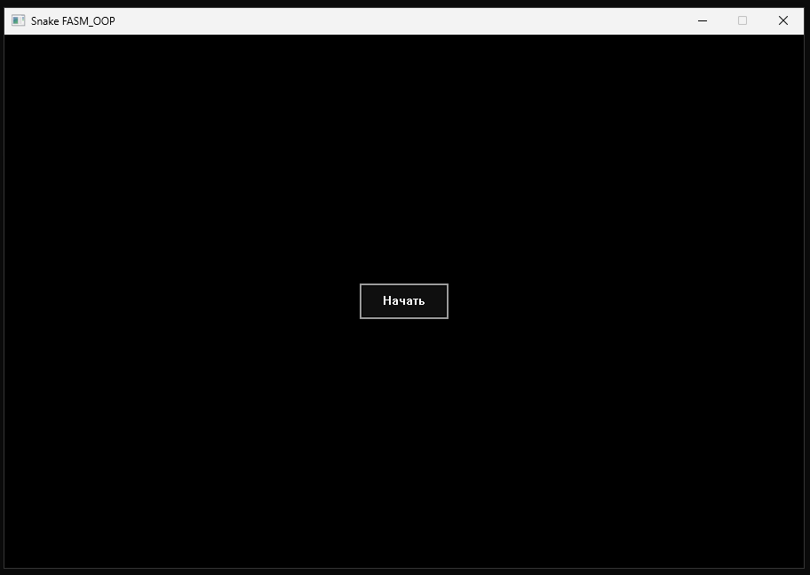
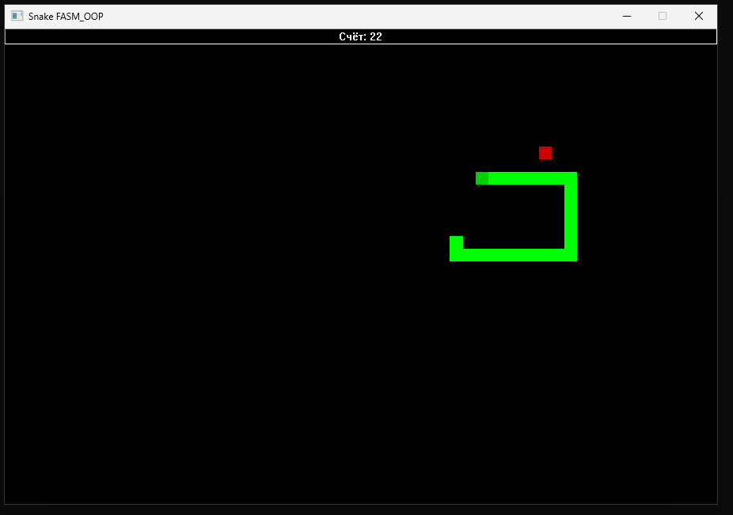

# Snake-FASM_OOP-using-example-
Графическая змейка на ассемблере FASM c использованием FASM_OOP для x86_64 под Windows.  
<figure>
    
    <figcaption>Стартовый экран</figcaption>
</figure>
<figure>
    
    <figcaption>Геймплей</figcaption>
</figure>
Для самостоятельной сборки необходимо подтянуть гитмодули  
`git clone --recurse-submodules https://github.com/ZReticules/Snake-FASM_OOP-using-example-`  

Для начала игры можно нажать Enter или ESC.  
Пробел ставит игру на паузу.  
Если нажать Enter или ESC во время игры, вас перенаправит обратно в меню.  
При нажатии Backspace во время игры приложение будет закрыто
